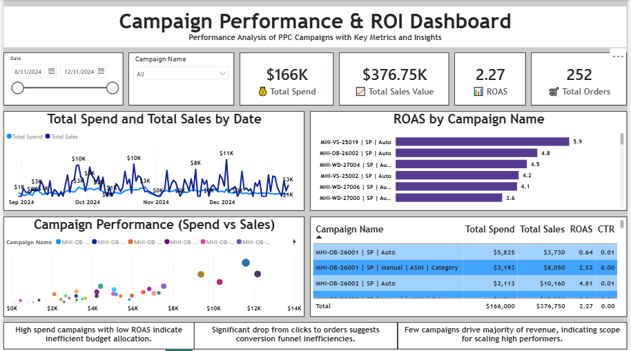

# 📊 PPC Campaign Performance & ROI Dashboard

## 📌 Overview
This project presents an end-to-end analysis of PPC (Pay-Per-Click) campaign performance using Power BI. The objective was to transform raw campaign data into an interactive dashboard to support data-driven marketing decisions and optimize advertising performance.

The dashboard focuses on evaluating campaign efficiency, identifying trends, and highlighting opportunities to improve return on ad spend (ROAS).

---

## 📊 Dataset Summary
- 📅 Time Period: 31 Aug 2024 – 31 Dec 2024  
- 📦 Total Records Analyzed: 6,854 rows  
- 📣 Total Campaigns: 36 campaigns  
- 🌍 Data Granularity: Daily campaign-level data  

---

## 🎯 Objectives
- Analyze campaign spend and revenue trends over time  
- Evaluate campaign efficiency using key performance indicators  
- Identify high-performing and underperforming campaigns  
- Provide actionable insights for marketing optimization  

---

## 📈 Key Metrics
- 💰 **Total Spend:** $166K  
- 💵 **Total Sales Value:** $376.75K  
- 📊 **ROAS:** 2.27  
- 🛒 **Total Orders:** 252  

---

## 📊 Dashboard Features

### 1. Performance Overview
- KPI cards summarizing overall campaign performance  
- Interactive filters for campaign and time-based analysis  

### 2. Trend Analysis
- Time-series visualization of spend vs sales  
- Helps identify performance fluctuations across the campaign period  

### 3. Campaign Comparison
- Comparison of campaign performance based on ROAS  
- Enables identification of efficient and inefficient campaigns  

### 4. Spend vs Sales Analysis
- Scatter plot analyzing relationship between spend and revenue  
- Highlights campaigns with high spend but lower returns  

### 5. Detailed Breakdown
- Campaign-level table with key performance metrics  
- Supports granular performance evaluation  

---

## 🔍 Key Insights
- A subset of campaigns contributes significantly to overall revenue  
- Certain campaigns show high spend but relatively lower returns, indicating optimization opportunities  
- Performance variation across campaigns suggests scope for improving targeting and budget allocation  

---

## 🛠️ Tools & Technologies
- **Power BI** – Dashboard development and data visualization  
- **Microsoft Excel** – Data cleaning and preprocessing  

---

## 🚀 Outcome
This dashboard enables stakeholders to:
- Monitor campaign performance effectively  
- Identify underperforming campaigns  
- Make data-driven decisions to improve ROI and optimize ad spend  

---

## 📌 Future Enhancements
- Add advanced marketing KPIs such as CTR, CPC, and conversion rate  
- Implement drill-through and deeper campaign-level analysis  
- Integrate with live data sources for real-time insights  

---

## 📷 Dashboard Preview

---

## 🤝 Connect
Open to feedback and opportunities in Data Analytics / Business Intelligence.
